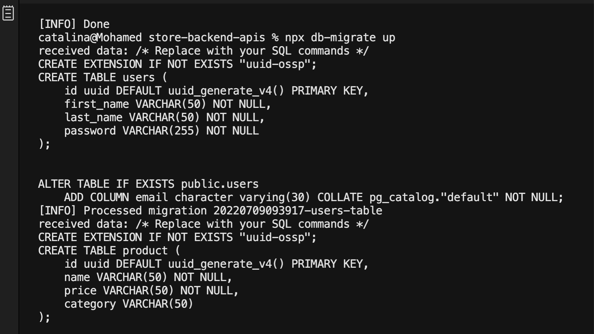
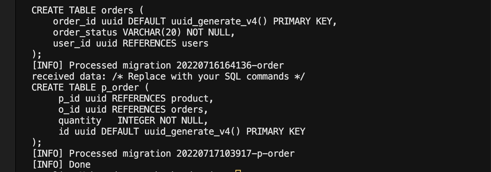
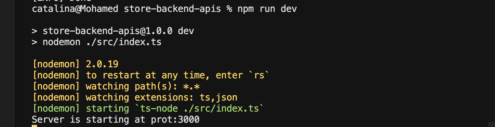
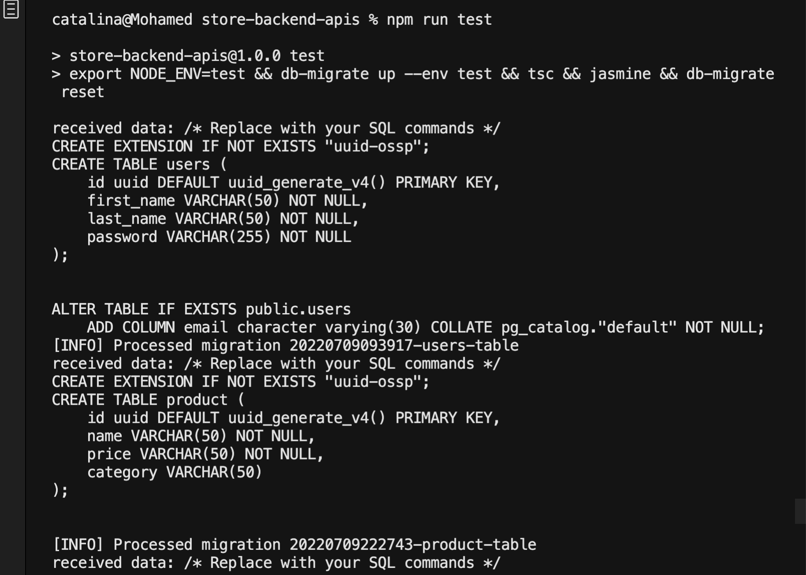
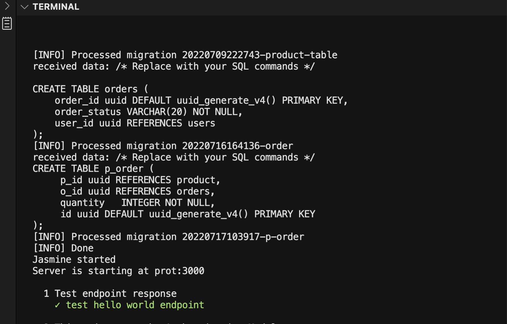
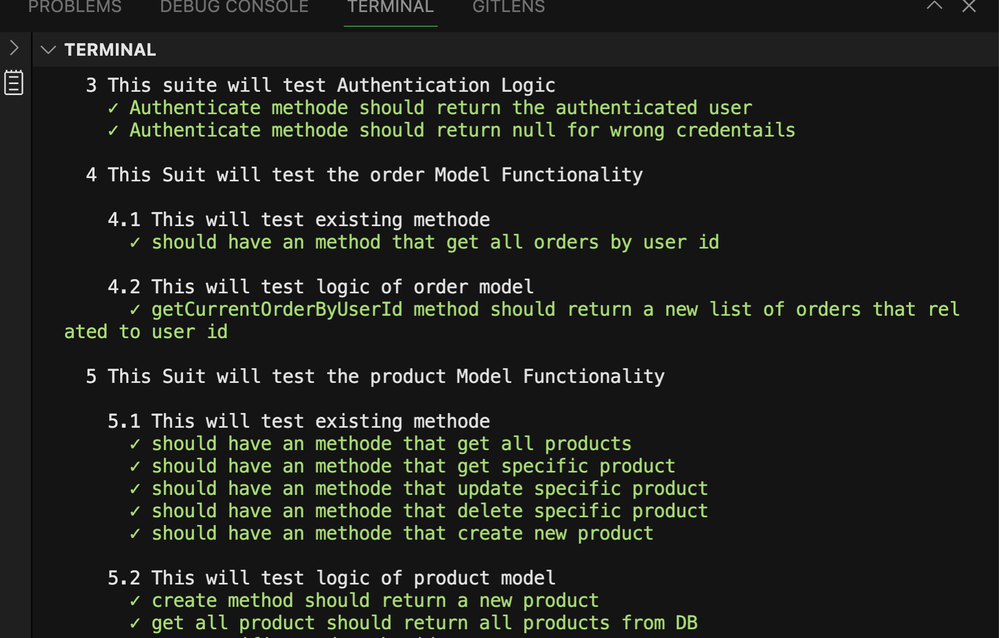

# Udacity: Build A Storefront Backend

This is a backend API build in Nodejs for an online store. It exposes a RESTful API that will be used by the frontend developer on the frontend.

The database schema and and API route information can be found in the [REQUIREMENT.md](REQUIREMENTS.md)

## Installation Instructions

This section contains all the packages used in this project and how to install them. However, you can fork this repo and run the following command at the root directory to install all packages.

`npm install`

### Packages

Here are some of the few packages that were installed.

#### express

`npm i -S express`
`npm i -D @types/express`

#### typescript

`npm i -D typescript`

#### db-migrate

`npm install -g db-migrate`

#### g

`npm install -g n`

#### bcrypt

`npm -i bcrypt`
`npm -i -D @types/bcrypt`

#### morgan

`npm install --save morgan`
`npm -i -D @types/morgan`

#### jsonwebtoken

`npm install jsonwebtoken --sav`
`npm -i -D @types/jsonwebtoken`

#### jasmine

`npm install jasmine @types/jasmine @ert78gb/jasmine-ts ts-node --save-dev`

#### supertest

`npm i supertest`
`npm i --save-dev @types/supertest`

## Set up Database

### Create Databases

We need to create dev and test database.

- connect to the default postgres database as the server's root user `psql -U postgres`
- In psql run the following to create a user
  - `CREATE USER postgres WITH PASSWORD '1997##**';`
- In psql run the following to create the dev and test database
  - `CREATE DATABASE store_dev;`
  - `CREATE DATABASE store_test;`
- Connect to the databases and grant all privileges
  - `\c store_dev`
  - `\c store_test`

### Migrate Database

Navigate to the root directory and run the command below to migrate the database

`npx db-migrate up`




## Enviromental Variables Set up

We have an .env file that contains all Enviroment Variables

##### listed below with description:

- PORT= 3000 this server port
- NODE_ENV=dev this default be env for our database configuration
- POSTGRES_HOST=localhost this our host name just connect locally so its be localhost
- POSTGRES_DB=store_dev this name database that will be connect
- POSTGRES_PORT=5432 this our port od database server
- POSTGRES_USER=store this user of database that we created a bove
- POSTGRES_PASSWORD=1997##\*\* this my pass for main postgres
- BCRYPT_PASSWORD=your-secret-password this is just any plain text to be the default pepper
- SALT_ROUNDS=10 this default salt for json web token
- TOKEN_SECRET=secret_key this used while json web token to generate token

```
PORT=3000
NODE_ENV=dev
POSTGRES_HOST=localhost

POSTGRES_DB=store_dev
POSTGRES_DB_TEST=store_test
POSTGRES_PORT=5432
POSTGRES_USER=postgres
POSTGRES_PASSWORD=1997##**
BCRYPT_PASSWORD=your-secret-password
SALT_ROUNDS=10
TOKEN_SECRET=secret_key
```

## Start App

`npm run dev`



### Running Ports

After start up, the server will start on port `3000` and the database on port `5432`

## Endpoint Access

All endpoints are described in the [REQUIREMENT.md](REQUIREMENTS.md) file.

## Token and Authentication

Tokens are passed along with the http header as

```
Authorization   Bearer <token>
```

## Testing

Run test with

`npm run test`

It sets the environment to `test`, migrates up tables for the test database, run the test then migrate down all the tables for the test database.





## Important Notes

### Changing Enviroment to testing

I had set up two databases, one for development and the other for testing. During testing, I had to make sure the testing database is used instead of the developement database.

To acheive this, I set up a variable in the `.env` file which is by default set to `dev`. During testing, we need to run command `export NODE_ENV=test && db-migrate up --env test && tsc && jasmine && db-migrate reset`

I export first Environment varaible NODE_ENV and set dev valud, after that run migration up with test database then compile typescript then run jasmine and finalyy reset out migration
